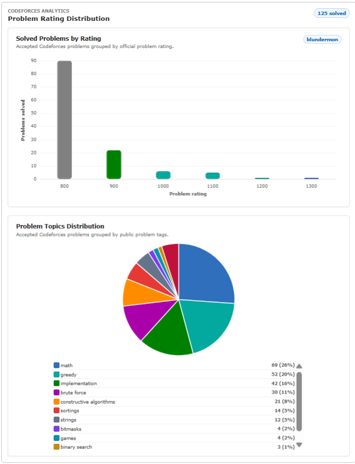
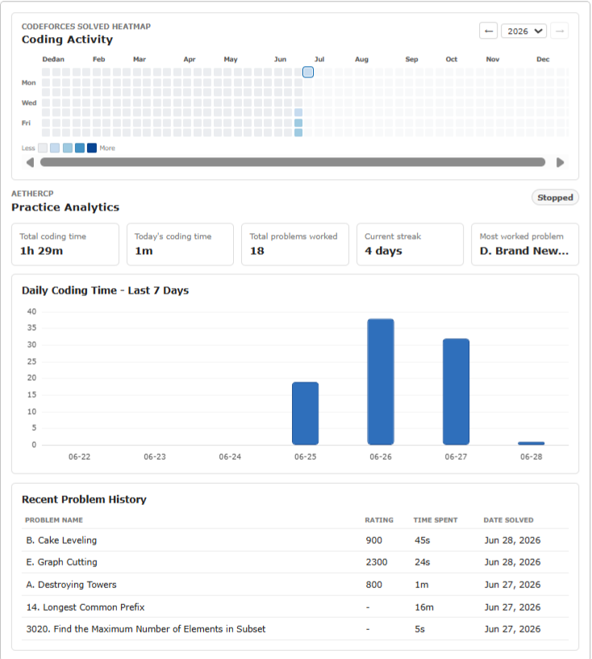
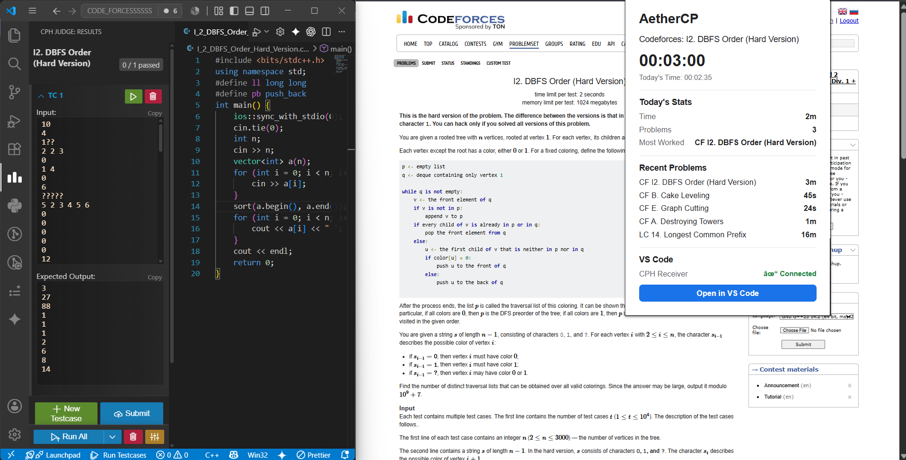

# AetherCP

> A privacy-first Chrome extension for competitive programmers that tracks Codeforces practice, visualizes productivity, and integrates seamlessly with VS Code.

[](https://developer.chrome.com/docs/extensions/mv3/)
[](LICENSE)

---

## What is AetherCP?

AetherCP is a Chrome / Microsoft Edge browser extension built for competitive programmers. It automatically tracks your coding sessions, augments Codeforces with powerful analytics, and streamlines your workflow by integrating directly with VS Code through the Competitive Companion protocol.

Unlike traditional coding trackers, **AetherCP is completely local-first**—there are no accounts, cloud servers, analytics, or telemetry. Your practice history never leaves your browser.

---

# Competitive Analytics

Analyze any Codeforces profile with rich visual insights.

<p align="center">
  
</p>

Features:

* 📊 Problem Rating Distribution
* 🏷️ Problem Topics Distribution
* 📈 Solved problem statistics
* 👤 Available on every Codeforces profile

---

# Practice Analytics

Track your own competitive programming journey over time.

<p align="center">
  
</p>

Features:

* 🔥 Full-year coding heatmap
* ⏱️ Daily coding time analytics
* 📅 Recent Problem History
* 📈 Coding streaks
* 📊 Personal productivity dashboard

---

# VS Code Integration

Open problems directly in VS Code with one click using Competitive Companion.

<p align="center">
  
</p>

Features:

* 🚀 One-click "Open in VS Code"
* 💻 Works with the Competitive Programming Helper (CPH) extension
* ⚡ Faster solve-test-submit workflow
* 📥 Automatically imports sample test cases


---

## Features

| Feature                     | Description                                                                                                           |
| --------------------------- | --------------------------------------------------------------------------------------------------------------------- |
| **Automatic Session Timer** | Starts and stops automatically when visiting supported problem pages. Idle-aware with a 15-minute inactivity timeout. |
| **Recent Problem History**  | Stores recent problems, ratings, timestamps, and time spent solving them.                                             |
| **Today's Analytics**       | Displays coding time, problems worked on, and current streak.                                                         |
| **Competitive Analytics**   | Rating distribution, topic distribution, and solved statistics for every Codeforces profile.                          |
| **Practice Analytics**      | Personal productivity dashboard with heatmap, daily graphs, and recent history.                                       |
| **VS Code Integration**     | Sends problems and sample test cases directly to VS Code through Competitive Companion.                               |
| **Context Menu Support**    | Right-click any supported problem page and open it directly in VS Code.                                               |

**Supported Platforms**

* ✅ Codeforces
* ✅ LeetCode (practice tracking)
* 🚧 AtCoder (planned)
* 🚧 CodeChef (planned)

---

## Installation

### From Source

1. Clone this repository.

```bash
git clone https://github.com/SujalUshir/AetherCP.git
```

2. Open:

```
chrome://extensions
```

or

```
edge://extensions
```

3. Enable **Developer Mode**.

4. Click **Load unpacked**.

5. Select the repository root.

The extension is now ready to use.

---

### Chrome Web Store

Coming soon.

---

### Microsoft Edge Add-ons

Coming soon.

---

## Architecture

AetherCP follows a clean Manifest V3 architecture with no build step and no backend.

```
Browser
      │
      ▼
Content Script
      │
      ▼
Background Service Worker
      │
      ▼
chrome.storage.local
      │
      ├──────── Popup UI
      │
      ├──────── Competitive Analytics
      │
      ├──────── Practice Analytics
      │
      └──────── VS Code (CPH)
```

### Core Components

```
manifest.json

src/
├── background/
├── content/
├── popup/
├── shared/
├── modules/
│   ├── analytics/
│   ├── timer/
│   ├── cph/
│   └── problem-tracking/
├── platform/
│   ├── codeforces/
│   └── leetcode/
├── utils/
└── vendor/
```

---

## Tech Stack

| Component          | Technology                    |
| ------------------ | ----------------------------- |
| Extension Platform | Chrome / Edge Manifest V3     |
| Language           | Vanilla JavaScript (ES2020)   |
| Styling            | Vanilla CSS                   |
| Charts             | Chart.js v4 (bundled locally) |
| Storage            | chrome.storage.local          |
| Backend            | None                          |
| Build Tool         | None                          |

---

## Privacy

AetherCP is designed around a **local-first, privacy-first philosophy**.

* ✅ No accounts
* ✅ No sign-up
* ✅ No telemetry
* ✅ No tracking
* ✅ No analytics SDKs
* ✅ No cloud backend
* ✅ No cookies

Only two external endpoints are ever contacted:

* **Codeforces Public API** — for profile statistics.
* **localhost:27121** — optional Competitive Companion receiver for VS Code.

All coding history remains on your own machine.

For the complete security model, see **[SECURITY.md](SECURITY.md)**.

---

## Data Stored

Everything is stored locally using `chrome.storage.local`.

Stored data includes:

* Coding sessions
* Problem history
* Time spent
* Daily totals
* Heatmap activity
* Cached Codeforces metadata

No information is uploaded or synchronized.

---

## Documentation

| Document                                                  | Description                     |
| --------------------------------------------------------- | ------------------------------- |
| [ARCHITECTURE.md](docs/ARCHITECTURE.md)                   | Project architecture            |
| [CURRENT_PROJECT_STATE.md](docs/CURRENT_PROJECT_STATE.md) | Current implementation overview |
| [FEATURES.md](docs/FEATURES.md)                           | Feature documentation           |
| [STORAGE_SCHEMA.md](docs/STORAGE_SCHEMA.md)               | Storage structure               |
| [TIMER_SYSTEM.md](docs/TIMER_SYSTEM.md)                   | Timer & idle detection          |
| [DEBUG_GUIDE.md](docs/DEBUG_GUIDE.md)                     | Debugging guide                 |
| [ROADMAP.md](docs/ROADMAP.md)                             | Planned features                |
| [CHANGELOG.md](docs/CHANGELOG.md)                         | Version history                 |
| [CPH_INTEGRATION.md](docs/features/CPH_INTEGRATION.md)    | VS Code integration             |
| [SECURITY.md](SECURITY.md)                                | Security & privacy              |

---

## VS Code Integration

AetherCP integrates with the **Competitive Programming Helper (CPH)** extension for Visual Studio Code.

Workflow:

1. Open a supported problem.
2. Click **Open in VS Code**.
3. Sample test cases are transferred automatically.
4. Start coding immediately.

CPH is **optional**. The extension works perfectly without it.

---

## Roadmap

* [ ] AtCoder support
* [ ] CodeChef support
* [ ] Contest analytics dashboard
* [ ] Automatic problem transfer to VS Code
* [ ] Custom idle timeout
* [ ] Theme customization
* [ ] Export practice history

---

## Contributing

Contributions are welcome.

1. Fork the repository.
2. Create a feature branch.
3. Implement your changes.
4. Submit a pull request.

Please read **SECURITY.md** before reporting security-related issues.

---

## License

This project is licensed under the MIT License.

See the [LICENSE](LICENSE) file for details.
